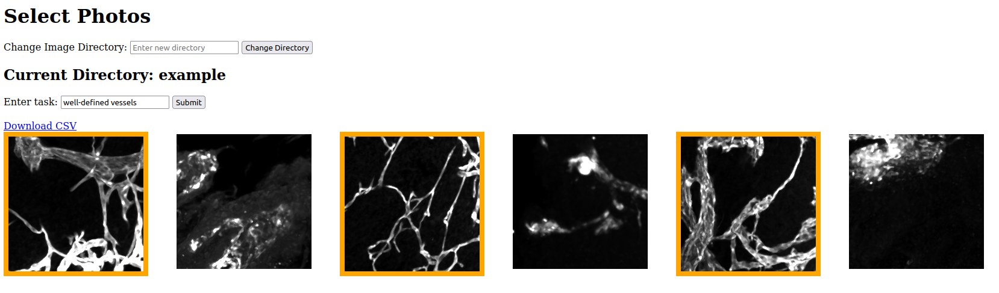
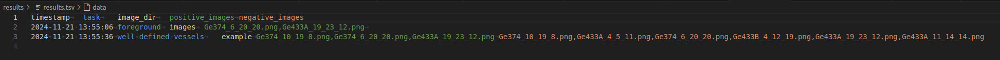

## Overview
Small web app for labeling based on 2D images.


## Install app

```bash
cd ~/code
git clone ...
# Create a conda environment with Flask installed
conda create -n photo-selection-app python=3.8 Flask python-dotenv
# or
cd ~/code/photo-selection-app           # path to project directory
conda env create -f environment.yaml
#  or conda env update -f environment.yaml
```

## Prepare session
Save images to be evaluated into one or several subfolders in the `static` folder.

## Optional: `ssh` command to browse the web app from a remote machine
```bash
# this prints the command that you need if you want 
echo "ssh ${USER}@${IP_ADDRESS} -L 5000:localhost:5000" 
# but you have to set the IP_ADDRESS shell env variable first (see below)
```

## Run app
```bash
conda activate photo-selection-app
cd ~/code/photo-selection-app           # path to project directory
flask run
# This will print a url to access the app from a browser
```

Then: `Ctrl` + click on the URL

## Perforn a task

- Specify the Image Directory you want to label.
- Click on the images you want to select
- Specify a name for the task
- Click `Submit`

## Output

You can access the output `TSV` file in the `results` folder, or click the `Download TSV` hyperlink in the Web App


## Optional: set the IP_ADRESS shell environment variable
```bash
# Run this:
ifconfig | grep inet
# In what line does your private IP appear?
# if the first line, run
ifconfig | grep 'inet ' | awk 'NR==1 {print $2}' # check the output is the correct address
# if the second line, run
ifconfig | grep 'inet ' | awk 'NR==2 {print $2}' # etc.
# then open the ~/.bashrc (or ~/.zshrc)
cd && nano .bashrc
# at the end, copy and paste this line:
export IP_ADDRESS=$(ifconfig | grep 'inet ' | awk 'NR==1 {print $2}') ## or NR==2...
echo $USERNAME@$HOSTNAME
echo $USERNAME@$IP_ADDRESS
# open a new terminal window/tab and close the old one
# If two lines appear, it means you're all set


